# Requirements Specification

## Feature Goal
Build an enterprise audit-only capability that detects cross-resource inconsistencies in FHIR patient records before they become operational or risk-management failures. Today, records may appear valid in isolation while contradictions remain hidden across conditions, medications, care plans, encounters, procedures, and observations. The target end state is deterministic contradiction detection with evidence-backed explanation, transparent audit artifacts, and governed human resolution workflows.

## Business Justification
- Improve enterprise data integrity by surfacing contradictions, stale states, and rule-defined missing/unsupported relationships before downstream use.
- Increase trust and auditability by pairing deterministic findings with evidence, AI rationale and confidence context, and full traceable metadata.
- Reduce manual reconciliation and triage delays through severity-based prioritization and mixed-ownership resolution routing.

## Feature Scope
User-visible behavior includes batch audit execution, finding review, evidence inspection, priority-based triage, and governed closure. Technical behavior includes deterministic contradiction detection, transparency field emission, reproducible logging, and explicit safety-bound enforcement that keeps the system audit-only.

### Success Criteria
- [ ] Detect at least 95% of known contradiction scenarios in MVP/pilot benchmark datasets.
- [ ] Populate at least 90% of findings with complete transparency fields (rule ID, records evaluated, evidence, AI rationale and confidence context, timestamp, audit outcome).
- [ ] Keep high-severity false-positive rate below 10% during MVP/pilot.
- [ ] Reduce median high-severity triage time by at least 40% versus current manual baseline in pilot operations.

## Functional Requirements

### Data Intake & Normalization
- FR-001: [DETERMINISTIC] [SOURCE:INPUT] System MUST ingest Conditions, Medications, Procedures, Encounters, Observations, and CarePlans from FHIR patient record batches.
  Basis: Brainstorm scope explicitly defines required FHIR input resource types and batch-oriented processing.
- FR-002: [DETERMINISTIC] [SOURCE:INPUT] System MUST normalize status, timestamp, and reference linkage fields needed for cross-resource consistency checks.
  Basis: The problem statement centers on cross-resource inconsistency, stale states, and timeline violations requiring normalized comparable fields.

### Deterministic Audit Engine
- FR-003: [DETERMINISTIC] [SOURCE:INPUT] System MUST establish contradiction findings using deterministic rule evaluation as the authoritative detection mechanism.
  Basis: The accepted architectural principle states deterministic rules establish contradictions and AI does not determine contradiction existence.
- FR-004: [DETERMINISTIC] [SOURCE:INPUT] System MUST detect stale-state and timeline-violation conditions defined in the active audit rule pack.
  Basis: Detection scope explicitly includes stale states and impossible timelines.
- FR-005: [DETERMINISTIC] [SOURCE:INPUT] System MUST flag missing or unsupported relationships only when those relationships are expected by defined audit rules.
  Basis: The finalized correction requires relationship gaps to be rule-expected rather than universally assumed.

### Evidence & Transparency
- FR-006: [DETERMINISTIC] [SOURCE:INPUT] System MUST output each finding with rule ID, records evaluated, evidence references, timestamp, and audit outcome.
  Basis: Audit transparency was explicitly added as a required feature and confirmed during scope finalization.
- FR-007: [HYBRID] [SOURCE:INPUT] System MUST generate AI rationale and confidence context tied to deterministic findings without changing finding status.
  Basis: The solution requires AI explanation value while preserving deterministic authority for contradiction detection.

### Prioritization & Workflow
- FR-008: [DETERMINISTIC] [SOURCE:INPUT] System MUST assign finding severity and triage priority using predefined rule-based criteria.
  Basis: Product outputs include severity and prioritization, and safety requires non-subjective contradiction adjudication.
- FR-009: [HYBRID] [SOURCE:INPUT] System MUST provide resolution suggestion drafts for human approval before any downstream resolution state change.
  Basis: The product includes recommended resolution with explicit human-governed workflow and no autonomous clinical action.
- FR-010: [DETERMINISTIC] [SOURCE:INPUT] System MUST route findings to configurable mixed-ownership queues and track status transitions through closure.
  Basis: Ownership was confirmed as mixed across stewardship, informatics, operations, and compliance teams.

### Safety & Governance
- FR-011: [DETERMINISTIC] [SOURCE:INPUT] System MUST enforce an audit-only boundary by blocking diagnostic conclusions, treatment recommendations, and clinical intent alteration.
  Basis: Safety boundary was repeatedly confirmed as non-negotiable and out-of-scope list excludes diagnostic behavior.
- FR-012: [DETERMINISTIC] [SOURCE:INPUT] System MUST preserve reproducible audit logs so sampled findings can be reconstructed from stored artifacts.
  Basis: Success criteria and transparency requirements require reproducibility for compliance and governance review.

## Use Case Analysis

### Actors & System Boundary
- Clinical Data Steward (Primary Actor): Reviews and resolves integrity findings.
- Clinical Informatics Analyst (Secondary Actor): Validates evidence context and prioritization accuracy.
- Compliance/Risk Reviewer (Secondary Actor): Verifies reproducibility and governance conformance.
- EHR/FHIR Data Source (System Actor): Supplies patient resource records to the audit workflow.
- Rule Management Service (System Actor): Provides versioned deterministic contradiction rule packs.

### System Context Diagram
<!-- RENDER type="plantuml" src="./uml-models/system-context.png" -->

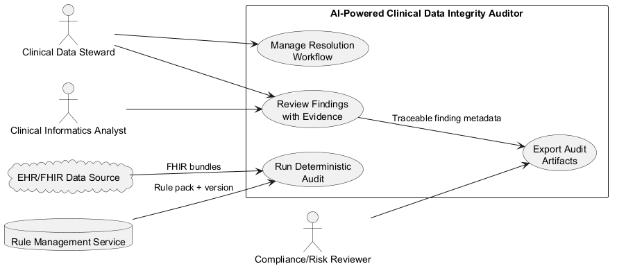

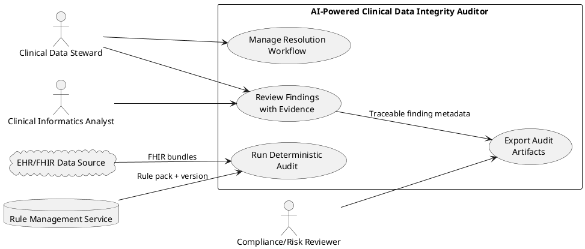

### Use Case Specifications
For each goal derive the use case and provide detailed specifications:

#### UC-001: Run Batch Integrity Audit
- **Actor(s)**: EHR/FHIR Data Source (System Actor)
- **Parent Requirements**: FR-001, FR-002, FR-003, FR-004, FR-005, FR-011
- **Goal**: Execute deterministic contradiction checks across a patient cohort batch.
- **Preconditions**: Valid audit rule pack is published; FHIR bundle is available; audit schedule is active.
- **Success Scenario**:
  1. System ingests FHIR resources for the batch.
  2. System normalizes linkage, state, and timeline fields.
  3. System executes deterministic contradiction and timeline rules.
  4. System records findings and marks batch run complete.
- **Extensions/Alternatives**:
  - 2a. If required resource classes are missing, system marks records as incomplete and continues with partial audit status.
  - 3a. If rule pack load fails, system aborts run and emits governance alert.
- **Postconditions**: Batch has deterministic findings with run status and safety-bound metadata.

##### Use Case Diagram

<!-- RENDER type="plantuml" src="./uml-models/uc-001-batch-audit.png" -->

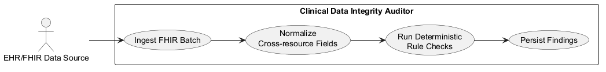

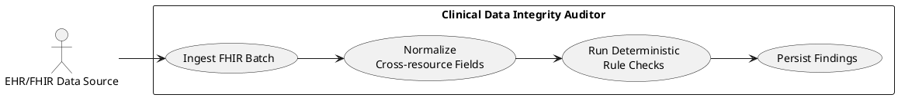

#### UC-002: Review and Triage Finding
- **Actor(s)**: Clinical Data Steward
- **Parent Requirements**: FR-003, FR-004, FR-005, FR-006, FR-007, FR-008, FR-011
- **Goal**: Determine triage outcome for a finding using transparent evidence.
- **Preconditions**: Finding exists with deterministic result and evidence payload.
- **Success Scenario**:
  1. Steward opens prioritized finding queue.
  2. System displays rule ID, evaluated records, evidence, AI rationale and confidence context, timestamp, and outcome.
  3. Steward validates contradiction context.
  4. Steward sets triage disposition (accept, escalate, or defer).
- **Extensions/Alternatives**:
  - 2a. If transparency fields are incomplete, system flags finding as non-actionable and routes for data-quality remediation.
  - 3a. If steward disputes contradiction, system routes to informatics review without altering deterministic finding record.
- **Postconditions**: Finding has a triage state and auditable reviewer decision.

##### Use Case Diagram

<!-- RENDER type="plantuml" src="./uml-models/uc-002-triage-review.png" -->

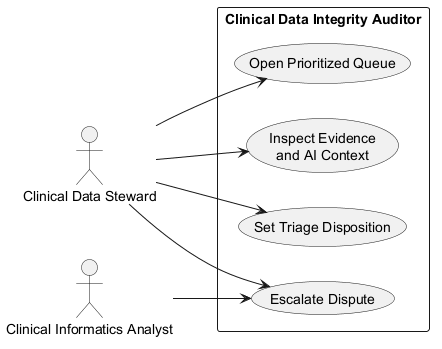

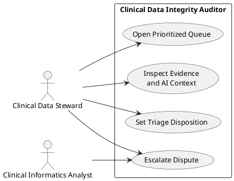

#### UC-003: Coordinate Resolution Workflow
- **Actor(s)**: Clinical Data Steward
- **Parent Requirements**: FR-008, FR-009, FR-010, FR-011
- **Goal**: Resolve accepted findings through mixed-ownership workflow.
- **Preconditions**: Finding is triaged and eligible for remediation.
- **Success Scenario**:
  1. Steward selects a finding for remediation.
  2. System proposes AI-assisted resolution draft.
  3. Steward approves or edits proposed action.
  4. System routes task to assigned owner queue and tracks status.
  5. Owner completes remediation and steward closes finding.
- **Extensions/Alternatives**:
  - 2a. If AI suggestion is low confidence, system requires manual resolution entry.
  - 4a. If no owner mapping exists, system escalates to governance queue.
- **Postconditions**: Finding reaches closed or escalated state with full audit trail.

##### Use Case Diagram

<!-- RENDER type="plantuml" src="./uml-models/uc-003-resolution-workflow.png" -->

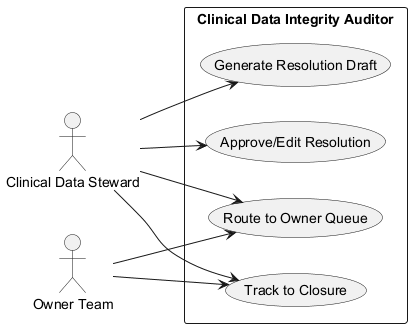

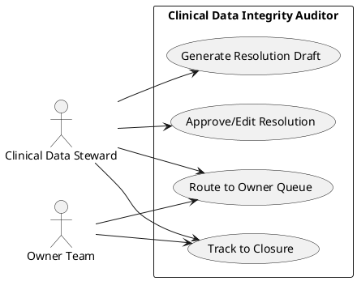

#### UC-004: Govern Rule Pack Version
- **Actor(s)**: Clinical Informatics Analyst
- **Parent Requirements**: FR-003, FR-005, FR-011
- **Goal**: Publish and activate validated deterministic rule versions.
- **Preconditions**: Candidate rule updates have governance review inputs.
- **Success Scenario**:
  1. Analyst submits candidate rule changes.
  2. System validates rule syntax and metadata completeness.
  3. Analyst publishes approved rule version.
  4. System activates new version for subsequent batch audits.
- **Extensions/Alternatives**:
  - 2a. If validation fails, system rejects publish and lists errors.
  - 4a. If activation fails, system rolls back to previous stable rule version.
- **Postconditions**: Active rule version and change history are auditable.

##### Use Case Diagram

<!-- RENDER type="plantuml" src="./uml-models/uc-004-rule-governance.png" -->

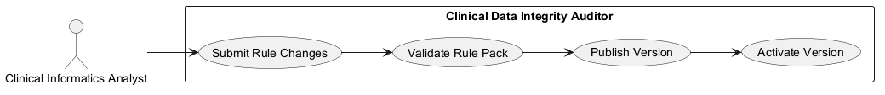

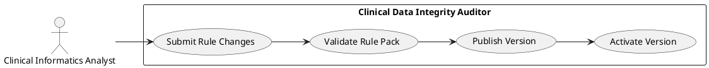

#### UC-005: Export Compliance Evidence
- **Actor(s)**: Compliance/Risk Reviewer
- **Parent Requirements**: FR-006, FR-012
- **Goal**: Reproduce and export sampled findings for audit review.
- **Preconditions**: Finding dataset and run metadata are retained.
- **Success Scenario**:
  1. Reviewer selects audit sample criteria.
  2. System retrieves finding packet and trace artifacts.
  3. System exports evidence bundle for review.
  4. Reviewer verifies reproducibility and signs off.
- **Extensions/Alternatives**:
  - 2a. If required artifact is missing, system marks sample as failed reproducibility and opens remediation issue.
  - 3a. If export formatting fails, system retries and logs failure event.
- **Postconditions**: Compliance evidence package and verification outcome are stored.

##### Use Case Diagram

<!-- RENDER type="plantuml" src="./uml-models/uc-005-compliance-export.png" -->

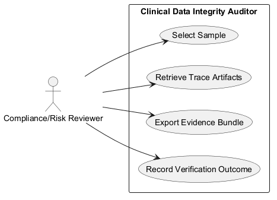

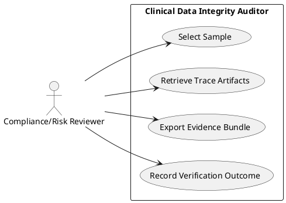

## Risks & Mitigations
- Rule drift or mis-specified contradiction logic: enforce governed rule versioning with validation, rollback, and change traceability.
- Alert fatigue from excess false positives: tune thresholds by severity tier and track pilot precision/acceptance metrics.
- Incomplete transparency fields reducing trust: block actionability when mandatory fields are missing and route to remediation.
- Boundary erosion into diagnostic behavior: enforce deterministic safety checks and explicit policy guardrails in output generation.

## Constraints & Assumptions
- The product remains audit-only and must not diagnose, prescribe, or alter clinical intent.
- Deterministic rules are the authoritative contradiction decision source; AI is explanatory/supportive only.
- Initial implementation scope is limited to Conditions, Medications, Procedures, Encounters, Observations, and CarePlans.
- Missing/unsupported relationship findings are constrained to explicitly defined audit rules.
- MVP/pilot target thresholds are goals for validation, not production baselines.
