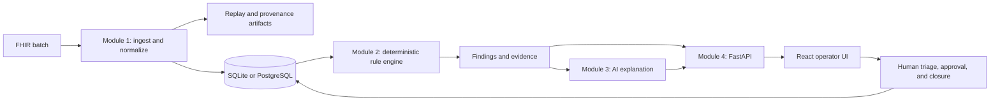

# Architecture

## Purpose

The AI-Powered Clinical Data Integrity Auditor evaluates FHIR patient records for
cross-resource data-integrity conditions. Deterministic rules establish findings; AI
provides explanation, evidence synthesis, and resolution drafts for human review. The
system is audit-only: it does not diagnose, recommend treatment, alter clinical intent,
or autonomously modify source records.

The business requirements and functional requirements remain the source of truth:
[BRD](../.propel/context/docs/brd.md) and [specification](../.propel/context/docs/spec.md).

## Component Model

## Processing Flow

1. Module 1 validates the FHIR batch, stages resources, normalizes statuses, timestamps, and references, and records validation state.
2. It persists normalized resources and writes replay/provenance artifacts so an audit can be reconstructed from the captured input.
3. Module 4 creates an audit run and passes normalized snapshots to module 2.
4. Module 2 executes the active deterministic rule pack and returns findings with rule IDs, evidence, severity, priority, and audit outcomes.
5. Module 4 persists findings and exposes them to the operator UI and API consumers.
6. When enabled, module 3 calls AWS Bedrock to generate an explanation, evidence synthesis, confidence context, and resolution draft. This never changes the deterministic finding status.
7. A steward or analyst reviews the evidence, then a steward approves a resolution and assigns ownership before remediation can begin. Every status transition is recorded.

## Runtime Boundaries

| Area | Current implementation | Operational implication |
| --- | --- | --- |
| API | FastAPI with SQLAlchemy | Routes use synchronous database access in FastAPI worker threads. |
| Data store | SQLite for local development; PostgreSQL supported | SQLite supports demos and tests; use PostgreSQL for a shared deployment. |
| Rule engine | Module 2 deterministic engine | The engine, not AI, is authoritative for contradiction existence. |
| AI | AWS Bedrock, optional | AI failures leave findings and evidence available; explanation jobs can fail independently. |
| UI | React, Vite, TanStack Query | The local Vite proxy forwards `/api` to the selected backend port. |
| Background work | FastAPI `BackgroundTasks` | Suitable for a single-process pilot; use a durable queue and workers before a multi-instance deployment. |
| Identity | Request headers in the pilot | `X-User-Id` and `X-User-Role` are not production authentication; place a trusted identity provider and server-side authorization in front of production use. |

## Governance Controls

- Deterministic rules establish every finding and preserve its rule/evidence lineage.
- Finding state transitions are validated on the server by role and lifecycle state.
- Remediation requires both an approved resolution and an assignment.
- Replay artifacts, evidence, status history, and explanation versions support
  reproducibility and compliance export.
- The health endpoint identifies the active audit engine and whether AI explanations
  are enabled.
